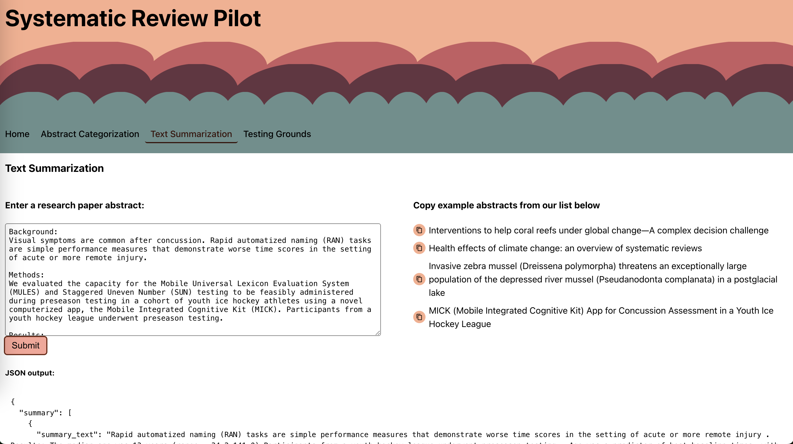

# systematic-review-pilot

## backend

Using Python, FastAPI, and HuggingFace with PyTorch

### To run

from the root directory run `sh start-docker.sh`

_note:_ make sure you have docker installed locally and the application is open when you run start docker

#### creating and running venv from start

the `sh start-backend.sh` does this

1. to create venv -- `python3 -m venv .venv`
2. to activate venv -- `source .venv/bin/activate`
3. install

### Snippet

